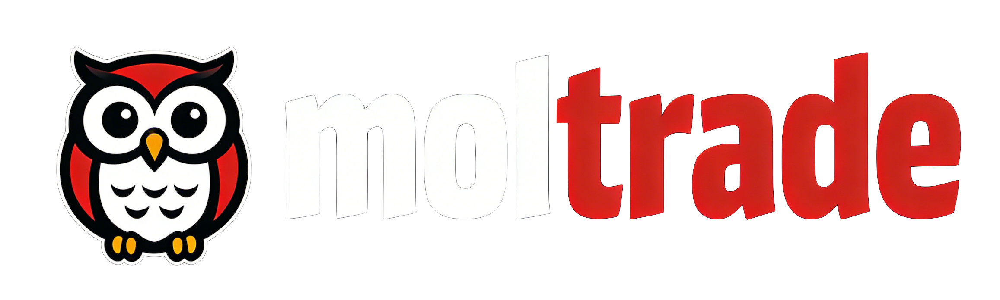

## 🦉 Moltrade —  The Automated AI Trading Assistant
<center>

<div align="center">
    <picture>
        <source media="(prefers-color-scheme: light)" srcset="./assets/moltrade-black.png">
        
    </picture>

<div style="text-align: center; font-weight: bold;">
<p align="center">
<strong>YOUR 24/7 AI TRADER ! EARNING MONEY WHILE YOU'RE SLEEPING.</strong>
</p>

</div>
</div>
</center>

---

### **Overview**
Moltrade is a decentralized, automated trading assistant that lets you run quant strategies, share encrypted signals, and allow others to copy your trades—all securely via the Nostr network. Earn reputation and credits based on your trading performance.

### **Core MVP Features (V1)**
*   **Local Trading Bot**: A Python bot that runs your quantitative strategies 24/7 on Hyperliquid.
*   **Secure Signal Sharing**: Broadcast your trading signals (encrypted) to specific followers over Nostr.
*   **One-Click Copy Trading**: Automatically execute trades by following encrypted signals from trusted traders.
*   **Credit & Reputation System**: Earn credits based on verified, on-chain trading performance. A public leaderboard showcases top traders.
*   **Lightweight Central Relay**: A minimal cloud service that manages subscriptions, relays encrypted signals, and calculates credits. **No access to private keys or funds.**

### **How It Works (Simplified Flow)**
1.  **Run Your Bot**: Download and configure your local bot with your Hyperliquid API keys (keys stay on your machine).
2.  **Generate & Encrypt**: Your bot generates a trade signal, encrypts it for your subscribers, and publishes it to Nostr.
3.  **Relay**: The Moltrade cloud service (acting as a "super node") picks up your signal and efficiently re-broadcasts it to your list of subscribers.
4.  **Copy & Execute**: Subscribers' bots decrypt the signal and execute the corresponding trade on their own Hyperliquid account.
5.  **Verify & Earn**: After a trade, bots submit the transaction hash to the cloud service. After on-chain verification, the system updates your credit score and ranking.

### **Getting Started**
**Prerequisites**
*   Python 3.10+
*   A Hyperliquid account (Testnet recommended for initial use)
*   A Nostr key pair (generated automatically by the bot)

**Installation & Setup**
1.  **Clone & Install**:
    ```bash
    git clone https://your-repo-url/moltrade-bot.git
    cd moltrade-bot
    pip install -r requirements.txt  # Installs nostr, hyperliquid-py, etc.
    ```
2.  **Configure Your Secrets**:
    *   Copy `config.example.json` to `config.json`.
    *   **Fill in your Hyperliquid account details (API keys and wallet)**.
    *   **Important**: Never commit this file or share your private keys.
3.  **Run the Bot**:
    ```bash
    python main.py
    ```
    The bot will start, generate a Nostr key pair for communication, and await configuration via its local API or admin panel.

### **Architecture & Integration with Your Ecosystem**
*   **Core (MVP)**: This `moltrade-bot` and the cloud relay form the self-sustaining MVP.
*   **OpenClaw/MoltBot (Future)**: In the future, you can use OpenClaw or MoltBot as an **external advisor**. You can manually ask it to review or optimize your strategy logic, then update your bot's `config.json`. This keeps the core trading system simple and robust.
*   **Prakasa Network (Roadmap)**: For users who don't want to run their own machine, future versions could offer to host this bot on the decentralized Prakasa compute network.

### **Roadmap**
*   **Phase 1 (Now)**: MVP as described above.
*   **Phase 2**: Integrate a simple web dashboard for strategy performance analytics and leaderboards.
*   **Phase 3**: Develop a plugin system for strategy bots and explore decentralized signal relay options.

### **Important Disclaimer**
Trading cryptocurrencies and derivatives carries significant risk. Moltrade is a tool for automation and social trading. You are solely responsible for any financial losses. Past performance is not indicative of future results.
